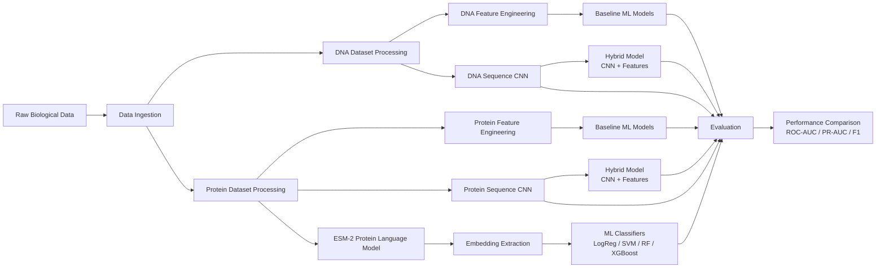

# 🧬 DNA & Protein Language Model Pipelines for Biological Sequence Analysis

## 📌 Project Overview

This project designs and evaluates machine learning pipelines for **biological sequence analysis** using both **DNA** and **protein** datasets.

The goal is to systematically compare multiple modeling paradigms:

- 🧠 Classical machine learning with engineered biological features  
- 🔬 Sequence-based deep learning models (CNNs)  
- ⚙️ Hybrid architectures combining learned representations and domain features  
- 🤖 Pretrained biological language models (ESM-2)

Two biological prediction tasks are explored:

| Task | Description |
|-----|-------------|
| **DNA Promoter Classification** | Detect promoter vs non-promoter regions in genomic DNA sequences |
| **Protein Family Classification** | Predict protein functional family from amino acid sequences |

The project evaluates whether **deep learning and foundation models provide measurable improvement over strong classical baselines.**

---
# 🧬 Project Pipeline



# 🧱 Repository Structure
```
Capstone/
│
├── app/                     # Future application or deployment interface
│
├── configs/                 # Experiment configuration files
│   └── config.yaml
│
├── data/                    # Biological datasets
│   ├── raw/                 # Original downloaded datasets
│   ├── interim/             # Intermediate processing files
│   └── processed/           # Clean datasets used for modeling
│
├── models/                  # Saved trained models
│   ├── dna/                 # DNA promoter classification models
│   │   ├── baselines
│   │   ├── sequence_cnn
│   │   └── hybrid
│   │
│   └── protein/             # Protein classification models
│       ├── baselines
│       ├── sequence_cnn
│       ├── hybrid_cnn_feats
│       └── esm2
│
├── notebooks/               # Main experiment workflow
│   ├── 00_project_overview.ipynb
│   ├── 01_protein_ingest.ipynb
│   ├── 02_protein_eda.ipynb
│   ├── 03_dna_ingest.ipynb
│   ├── 04_dna_eda.ipynb
│   ├── 05_dna_baseline_features.ipynb
│   ├── 06_dna_baseline_models.ipynb
│   ├── 07_dna_sequence_models.ipynb
│   ├── 08_dna_hybrid_model.ipynb
│   ├── 09_protein_baseline_features.ipynb
│   ├── 10_protein_baseline_models.ipynb
│   ├── 11_protein_sequence_models.ipynb
│   ├── 12_protein_hybrid_model.ipynb
│   ├── 13_protein_esm2_embeddings.ipynb
│   └── 14_protein_esm2_models.ipynb
│
├── reports/                 # Experiment outputs and evaluation summaries
│   └── figures/             # Visualizations (ROC curves, confusion matrices)
│
├── scripts/                 # Utility scripts for processing or training
│
└── src/                     # Reusable project code
├── common
├── dna
└── protein
```
---
# 📁 Key Files

Important outputs produced by the modeling pipeline include:

| File | Location | Description |
|-----|-----|-----|
| `dna_promoter_vs_nonpromoter_len200_pos2000_neg2000.csv` | data/processed | Processed dataset used for DNA promoter classification |
| `protein_uniprot_pfam_top10_per400.csv` | data/processed | Dataset used for protein family classification |
| `protein_esm2_embeddings_top10_per400.npy` | data/processed | Protein embeddings generated using the ESM-2 model |
| `cnn_len200.pt` | models/dna/sequence_cnn | Trained DNA sequence CNN |
| `cnn_top10_per400.pt` | models/protein/sequence_cnn | Trained protein sequence CNN |

---
# 🔬 Project Workflow

The project follows a structured machine learning workflow.

### 1️⃣ Data Ingestion
Raw datasets are collected and curated from genomic annotations and protein databases.

- DNA promoter sequences extracted from genome annotations  
- Protein sequences curated from UniProt datasets  

---

### 2️⃣ Exploratory Data Analysis (EDA)

EDA is used to validate data quality and biological signal.

Key analyses include:

- Sequence length distributions  
- GC content and CpG density (DNA)  
- Amino acid composition (protein)  
- Feature distributions  
- Class balance analysis  

---

### 3️⃣ Feature Engineering

Biologically meaningful features are extracted from sequences.

#### DNA Features
- GC content
- CpG density
- k-mer frequencies
- sequence composition statistics

#### Protein Features
- amino acid composition
- physicochemical properties
- sequence length statistics

These features form the basis for **baseline machine learning models**.

---

# 🤖 Modeling Approaches

The project compares four model families.

---

## 1️⃣ Feature-Based Baselines

Traditional ML models trained on engineered biological features.

Models evaluated:

- Logistic Regression  
- Linear SVM  
- Random Forest  
- Gradient Boosting  
- XGBoost  

These models establish the **baseline performance floor**.

---

## 2️⃣ Sequence CNN Models

Deep learning models trained directly on biological sequences.

Architecture includes:

- One-hot sequence encoding  
- 1D convolutional filters for motif detection  
- pooling layers  
- dense classification layers  

These models automatically learn **sequence motifs and biological patterns**.

---

## 3️⃣ Hybrid Models

Hybrid models combine:

- CNN sequence embeddings  
- engineered biological features  

This approach evaluates whether **combining domain knowledge with learned representations improves predictive performance**.

---

## 4️⃣ Biological Language Models

Pretrained biological language models are used to generate sequence embeddings that capture complex biological patterns learned from large-scale sequence datasets.

### DNA Language Models

For genomic sequences, embeddings are generated using **DNABERT / Nucleotide Transformer models** trained on large genomic corpora.

These models learn contextual nucleotide representations that capture promoter signals and regulatory sequence patterns.

Workflow:

DNA sequence → DNA language model embedding → ML classifier

---

### Protein Language Models

For protein sequences, embeddings are generated using **ESM-2**, a pretrained transformer trained on millions of protein sequences.

Workflow:

Protein sequence → ESM-2 embedding → ML classifier

---

### Classifiers Trained on Embeddings

The extracted embeddings are used as input features for classical machine learning classifiers:

- Logistic Regression  
- Support Vector Machine (SVM)  
- Random Forest  
- XGBoost  

This allows evaluation of whether **foundation model embeddings improve biological sequence classification performance compared to handcrafted features and CNN models.**
---

# 📓 Notebooks Overview

The project notebooks follow a structured experimental pipeline.

| Notebook | Purpose |
|--------|--------|
| `00_project_overview` | Project design and experiment planning |
| `01_protein_ingest` | Load and preprocess protein datasets |
| `02_protein_eda` | Protein exploratory analysis |
| `03_dna_ingest` | Load genomic promoter datasets |
| `04_dna_eda` | DNA sequence exploratory analysis |
| `05_dna_baseline_features` | DNA feature engineering |
| `06_dna_baseline_models` | Classical ML baselines |
| `07_dna_sequence_models` | CNN models for DNA |
| `08_dna_hybrid_model` | Hybrid CNN + features |
| `09_protein_baseline_features` | Protein feature engineering |
| `10_protein_baseline_models` | Classical ML baselines |
| `11_protein_sequence_models` | CNN models for protein |
| `12_protein_hybrid_model` | Hybrid protein model |
| `13_protein_esm2_embeddings` | Extract ESM-2 embeddings |
| `14_protein_esm2_models` | Train classifiers on embeddings |

---

# 📊 Evaluation Metrics

Model performance is evaluated using multiple metrics:

| Metric | Purpose |
|------|--------|
| Accuracy | Overall classification performance |
| Precision | Correct positive predictions |
| Recall | Ability to capture true positives |
| F1 Score | Balanced precision-recall metric |
| ROC-AUC | Classification separability |
| PR-AUC | Performance under class imbalance |

---

# 🧭 How to Navigate This Repository

To explore the project:

1️⃣ Start with **`notebooks/`** to follow the full analysis pipeline  
2️⃣ Review **`reports/`** for experiment outputs and summaries  
3️⃣ Inspect **`models/`** for saved trained models  
4️⃣ Explore **`src/`** for reusable modeling code  
5️⃣ Check **`data/`** for dataset organization

---

# 👥 Collaborators

Instructor  
**Edwin Marte Zorrilla**

Advisor  
**Matt Gitzendanner**

---

# 👩‍💻 Author

**Deepika Sarala Pratapa**  
M.S. Applied Data Science  
University of Florida
📧 [dpratapa@ufl.edu](mailto:dpratapa@ufl.edu) 
