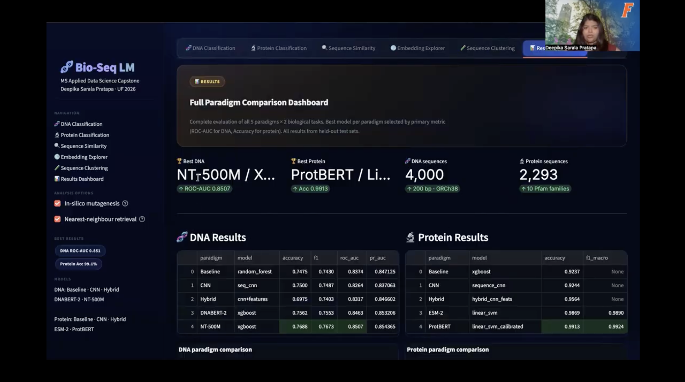
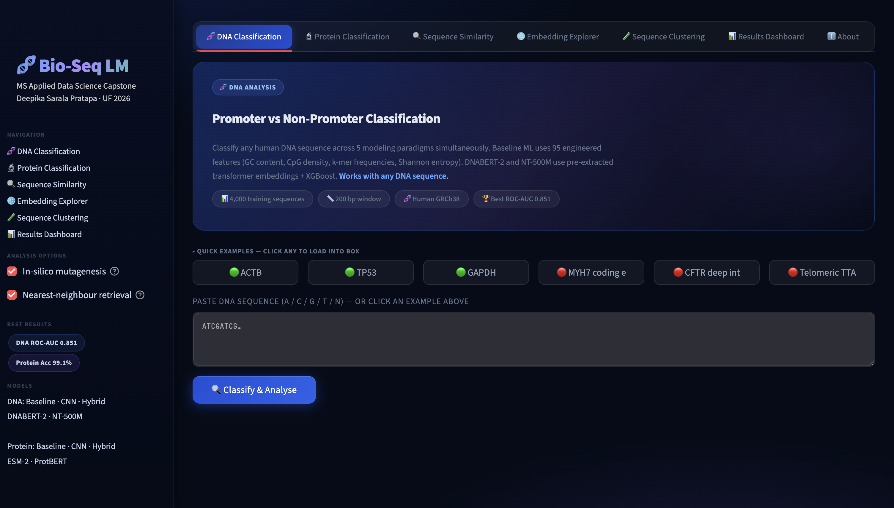
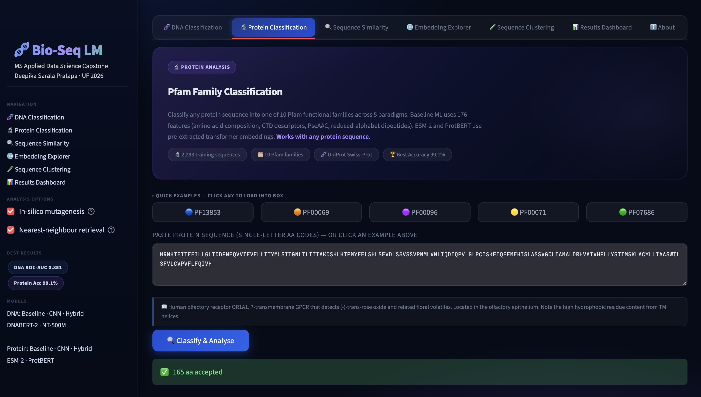
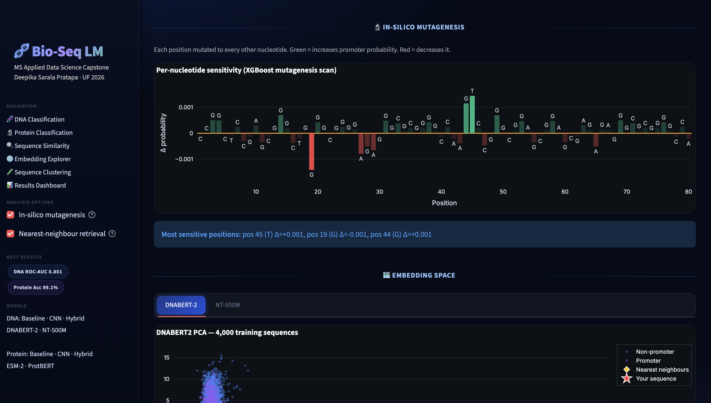
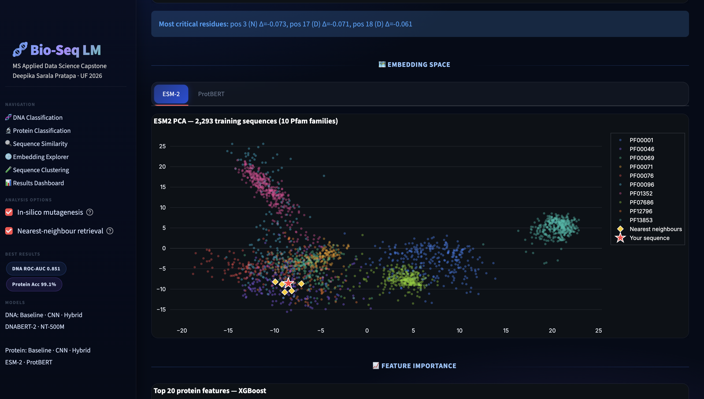
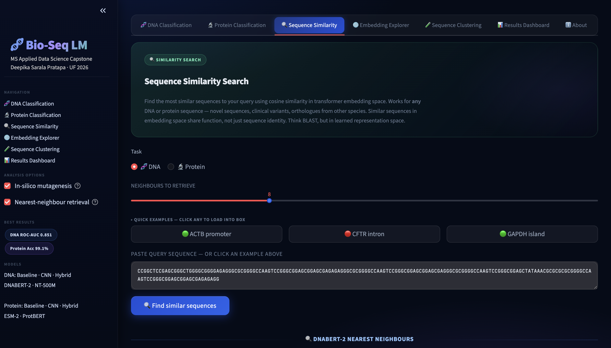
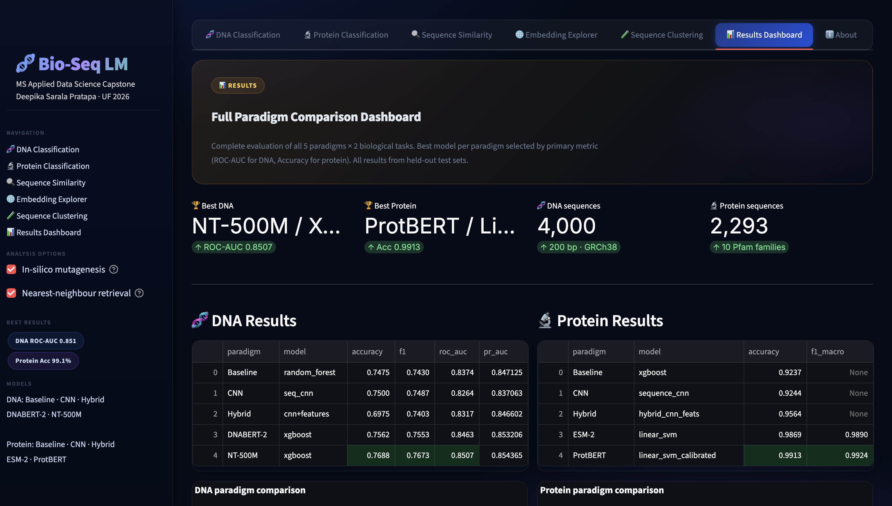

# 🧬 Bio-Seq LM — DNA & Protein Language Model Pipelines

<div align="center">

**Design and Evaluation of DNA & Protein Language Model Pipelines for Biological Sequence Analysis**

*M.S. Applied Data Science Capstone · University of Florida · Spring 2026*

[](https://python.org)
[](https://pytorch.org)
[](https://huggingface.co)
[](https://streamlit.io)
[](https://www.rc.ufl.edu/about/hipergator/)
[](LICENSE)
[](https://huggingface.co/spaces/dpratapa/bio-seq-lm-explorer)

[🚀 Live App](https://huggingface.co/spaces/dpratapa/bio-seq-lm-explorer) · [📊 Results](#-results) · [📓 Notebooks](#-notebooks) · [🛠 Setup](#-setup) · [🖥️ App](#️-interactive-app--bio-seq-lm-explorer)

</div>

---

## 📌 Overview

Do large pretrained biological language models **consistently outperform engineered baselines** — or is their advantage task-dependent?

This project answers that question through a rigorous, end-to-end comparison of **5 modeling paradigms** across **2 biological sequence tasks**:

| Task | Data | Scale | Primary Metric |
|------|------|-------|----------------|
| 🧬 **DNA Promoter Classification** | Human GRCh38 · 200 bp sequences | 4,000 sequences (balanced) | ROC-AUC |
| 🔬 **Protein Pfam Classification** | UniProt Swiss-Prot · 10 Pfam families | 2,293 sequences | Accuracy + F1-macro |

---

## 🏆 Results

### DNA — Promoter vs Non-Promoter Classification

| Paradigm | Best Model | Accuracy | ROC-AUC |
|----------|-----------|----------|---------|
| Baseline ML | Random Forest | 0.748 | 0.837 |
| CNN | Seq-CNN | 0.750 | 0.826 |
| Hybrid | CNN + features | 0.698 | 0.832 |
| DNABERT-2 | XGBoost | 0.756 | 0.846 |
| **NT-500M ★** | **XGBoost** | **0.769** | **0.851** |

> **Key finding:** NT-500M/XGBoost achieves ROC-AUC 0.851 — only **+1.5 pts above Random Forest baseline**. Engineered CpG/GC features remain highly competitive for this task.

### Protein — Pfam Family Classification

| Paradigm | Best Model | Accuracy | F1-macro |
|----------|-----------|----------|---------|
| Baseline ML | Random Forest | 0.923 | 0.924 |
| CNN | Seq-CNN | 0.924 | 0.925 |
| Hybrid | CNN + features | 0.956 | 0.957 |
| ESM-2 | Linear SVM | 0.987 | 0.989 |
| **ProtBERT ★** | **Linear SVM** | **0.991** | **0.992** |

> **Key finding:** ProtBERT/Linear SVM achieves **99.1% accuracy — +7 pts over Hybrid**. Pfam families are linearly separable in UniRef100 pretrained embedding space.

---

## 🖥️ Interactive App — Bio-Seq LM Explorer

A full-featured Streamlit application for real-time biological sequence analysis — no retraining required. No GPU needed to run the app; all transformer embeddings are pre-extracted and cached as `.npy` files.

**🚀 [Launch Live App → huggingface.co/spaces/dpratapa/bio-seq-lm-explorer](https://huggingface.co/spaces/dpratapa/bio-seq-lm-explorer)**

### 🎬 Demo Video

> 🎬 **[Video Demo](https://drive.google.com/drive/folders/1_e-JD7NuzYQWnCyiY3f02vL_0UVEKG72)**
[](#)

### App Features

| Tab | Description |
|-----|-------------|
| 🧬 **DNA Classification** | Classify any 200 bp sequence across 5 paradigms simultaneously. Includes in-silico mutagenesis and embedding space visualization |
| 🔬 **Protein Classification** | Pfam family prediction across 5 paradigms with alanine scanning and top-3 family confidence |
| 🔍 **Sequence Similarity** | Cosine similarity search in transformer embedding space (DNABERT-2, NT-500M, ESM-2, ProtBERT) |
| 🌐 **Embedding Explorer** | Interactive PCA of 4,000 DNA and 2,293 protein sequences — hover to inspect any point |
| 🧪 **Sequence Clustering** | Unsupervised KMeans clustering of 2–10 sequences in feature space with pairwise similarity heatmap |
| 📊 **Results Dashboard** | Full paradigm comparison with interactive Plotly charts and key findings narrative |

### App Screenshots

| | |
|--|--|
|  **DNA Classification** |  **Protein Classification** |
|  **In-Silico Mutagenesis** |  **Embedding Explorer** |
|  **Sequence Similarity** |  **Results Dashboard** |

---

## 🔬 Methodology

```
Raw Sequences (GRCh38 DNA · UniProt Protein)
            │
    ┌───────┴────────┐
    ▼                ▼
Feature Engineering  Transformer Embeddings
95 DNA features      DNABERT-2 · NT-500M (DNA)
176 Protein features ESM-2 · ProtBERT (Protein)
    │                │
    └───────┬────────┘
            ▼
  Downstream Classifiers
  LR · SVM · RF · XGBoost
            │
            ▼
  Evaluation & Comparison
  ROC-AUC (DNA) | Accuracy + F1 (Protein)
```

### Modeling Paradigms

1. **Baseline ML** — Classical models (LR, SVM, RF, GBM, XGBoost) on engineered biological features
2. **Sequence CNN** — 1D convolutional networks on one-hot encoded sequences
3. **Hybrid** — CNN sequence embeddings concatenated with engineered features
4. **DNA LMs** — DNABERT-2 (117M params, BPE, 135-species) and NT-500M (500M params, GRCh38)
5. **Protein LMs** — ESM-2 (35M params, UR50D) and ProtBERT (420M params, UniRef100)

### Feature Engineering

**DNA (95 features):** GC content, CpG O/E ratio, k-mer frequencies (di/tri-nucleotide), Shannon entropy, homopolymer runs, dinucleotide composition

**Protein (176 features):** CTD descriptors, PseAAC, reduced-alphabet dipeptides, amino acid composition, physicochemical properties (GRAVY, instability, aromaticity, isoelectric point)

---

## 🗂️ Repository Structure

```
bio-ai-capstone/
│
├── app/
│   └── app.py                   # Streamlit app — Bio-Seq LM Explorer
│
├── configs/
│   └── config.yaml              # Experiment configuration
│
├── data/
│   └── processed/               # Preprocessed datasets and cached embeddings
│       ├── dna_promoter_vs_nonpromoter_len200_pos2000_neg2000.csv
│       ├── dna_dnabert2_embeddings_len200_pos2000_neg2000.npy
│       ├── dna_dnabert2_labels_len200_pos2000_neg2000.npy
│       ├── dna_dnabert2_ids_len200_pos2000_neg2000.npy
│       ├── dna_nt_embeddings_len200_pos2000_neg2000.npy
│       ├── dna_nt_labels_len200_pos2000_neg2000.npy
│       ├── dna_nt_ids_len200_pos2000_neg2000.npy
│       ├── protein_uniprot_pfam_top10_per400.csv
│       ├── protein_esm2_embeddings_top10_per400.npy
│       ├── protein_esm2_labels_top10_per400.npy
│       ├── protein_protbert_embeddings_top10_per400.npy
│       └── protein_protbert_labels_top10_per400.npy
│
├── docs/
│   ├── screenshots/             # App screenshots
│   └── poster/                  # Capstone poster (PDF)
│
├── models/
│   ├── dna/
│   │   ├── baselines/           # logreg, random_forest, xgboost, linear_svm .pkl files
│   │   ├── dnabert2/            # xgboost.pkl, linear_svm.pkl, etc.
│   │   ├── nt/                  # xgboost.pkl, linear_svm.pkl, etc.
│   │   ├── sequence_cnn/        # cnn_len200.pt
│   │   └── hybrid/              # hybrid_len200.pt, feature_scaler.pkl
│   └── protein/
│       ├── baselines/           # logreg, random_forest, xgboost, linear_svm .pkl files
│       ├── esm2/                # linear_svm_esm2.pkl, logreg_esm2.pkl, etc.
│       ├── protbert/            # linear_svm_calibrated.pkl, etc.
│       ├── sequence_cnn/        # cnn_top10_per400.pt
│       └── hybrid_cnn_feats/    # hybrid_top10_per400.pt
│
├── notebooks/                   # NB00–NB21 full experiment pipeline (see table below)
├── reports/                     # CSVs and JSONs with all experimental results
├── environment.yml              # Full conda environment (HiPerGator / GPU systems)
├── requirements.txt             # Minimal pip requirements (app only, no GPU needed)
└── README.md
```

---

## 🛠 Setup

### Prerequisites

- Python 3.11
- `conda` (recommended) or `pip`
- **GPU required only for notebooks 15–20** (transformer embedding extraction). All other notebooks and the app itself run on CPU.

### Option A — Full Conda Environment (recommended for running all notebooks)

This installs PyTorch, HuggingFace Transformers, and all dependencies needed for embedding extraction. Designed for Linux/HiPerGator with CUDA.

```bash
git clone https://github.com/deepikapratapa/bio-ai-capstone.git
cd bio-ai-capstone

conda env create -f environment.yml
conda activate bio-seq-lm
```

> ⚠️ The `environment.yml` includes PyTorch with CUDA support. On a CPU-only machine, resolve may be slow. Use Option B if you only want to run the app.

### Option B — Minimal pip install (app only, no GPU needed)

All transformer embeddings are pre-extracted and committed to the repo as `.npy` files. The app loads these directly — no model download, no GPU required.

```bash
git clone https://github.com/deepikapratapa/bio-ai-capstone.git
cd bio-ai-capstone

pip install -r requirements.txt
```

`requirements.txt` contains:
```
streamlit>=1.32.0
numpy==1.26.4
pandas
scikit-learn
joblib
plotly==5.18.0
matplotlib
biopython
xgboost
```

### Running the Streamlit App

```bash
# From the repo root
cd bio-ai-capstone
streamlit run app/app.py
```

The app will open at `http://localhost:8501`. All 6 tabs should load fully — classifiers are loaded from `models/` and embeddings from `data/processed/`.

### Running Notebooks

Notebooks NB00–NB14 (feature engineering, EDA, baseline models, CNN, hybrid) run on **CPU**. Notebooks NB15–NB20 (transformer embedding extraction) require a **CUDA-capable GPU** and are designed for UF HiPerGator.

```bash
# Activate the conda environment first
conda activate bio-seq-lm

# Start Jupyter
jupyter lab
```

On **HiPerGator** (SLURM + A100 GPU):

```bash
# Request an interactive GPU session
srun --partition=hpg-ai --ntasks=1 --cpus-per-task=4 --mem=32gb \
     --gpus=a100:1 --time=04:00:00 --pty bash -i

module load conda
conda activate bio-seq-lm

cd /path/to/bio-ai-capstone
jupyter lab --no-browser --port=8888
```

Then SSH tunnel from your local machine:
```bash
ssh -NL 8888:<compute_node_hostname>:8888 <username>@hpg.rc.ufl.edu
```
Open `http://localhost:8888` in your browser.

### Notebook Execution Order

Run notebooks sequentially. Each notebook saves its outputs (`.npy` embeddings, `.pkl` models, `.csv` results) which are consumed by later notebooks and by the app.

```
NB00 → NB01 → NB02 → NB03 → NB04          # Project setup, data ingest, EDA
NB05 → NB06                                # DNA baseline features + models
NB07 → NB08                                # DNA CNN + Hybrid
NB09 → NB10                                # Protein baseline features + models
NB11 → NB12                                # Protein CNN + Hybrid
NB13 → NB14                                # ESM-2 embeddings + classifiers  [GPU]
NB15 → NB16                                # DNABERT-2 embeddings + classifiers [GPU]
NB17 → NB18                                # NT-500M embeddings + classifiers [GPU]
NB19 → NB20                                # ProtBERT embeddings + classifiers [GPU]
NB21                                       # Final cross-paradigm comparison
```

> **Note:** If you skip the GPU notebooks (NB13–NB20), the pre-extracted `.npy` embeddings already committed to this repo will allow NB16, NB18, NB20, and NB21 (classifier training + comparison) to run on CPU.

---

## 📓 Notebooks

| # | Notebook | Description | GPU? |
|---|----------|-------------|------|
| 00 | `00_project_overview` | Project design, experiment plan, research question | No |
| 01 | `01_protein_ingest` | UniProt Swiss-Prot data loading and curation | No |
| 02 | `02_protein_eda` | Amino acid composition, length distributions, class balance | No |
| 03 | `03_dna_ingest` | GRCh38 promoter/non-promoter extraction | No |
| 04 | `04_dna_eda` | GC content, CpG analysis, sequence statistics | No |
| 05 | `05_dna_baseline_features` | DNA feature engineering (95 features) | No |
| 06 | `06_dna_baseline_models` | Classical ML baselines — RF achieves AUC 0.837 | No |
| 07 | `07_dna_sequence_models` | 1D CNN on one-hot DNA — AUC 0.826 | No |
| 08 | `08_dna_hybrid_model` | CNN + feature hybrid — AUC 0.832 | No |
| 09 | `09_protein_baseline_features` | Protein feature engineering (176 features) | No |
| 10 | `10_protein_baseline_models` | Classical ML baselines — RF accuracy 0.923 | No |
| 11 | `11_protein_sequence_models` | CNN on amino acid sequences — accuracy 0.924 | No |
| 12 | `12_protein_hybrid_model` | Hybrid CNN + features — accuracy 0.956 | No |
| 13 | `13_protein_esm2_embeddings` | ESM-2 (35M) embedding extraction | **Yes** |
| 14 | `14_protein_esm2_models` | Classifiers on ESM-2 embeddings — accuracy 0.987 | No |
| 15 | `15_dna_dnabert2_embeddings` | DNABERT-2 embedding extraction | **Yes** |
| 16 | `16_dna_dnabert2_models` | Classifiers on DNABERT-2 — AUC 0.846 | No |
| 17 | `17_dna_nt_embeddings` | NT-500M embedding extraction | **Yes** |
| 18 | `18_dna_nt_models` | Classifiers on NT-500M — AUC 0.851 ★ | No |
| 19 | `19_protein_protbert_embeddings` | ProtBERT (420M) embedding extraction | **Yes** |
| 20 | `20_protein_protbert_models` | Classifiers on ProtBERT — accuracy 0.991 ★ | No |
| 21 | `21_final_comparison` | Full cross-paradigm comparison and visualizations | No |

---

## 🔑 Key Takeaways

1. **Transformer models dramatically improve protein classification** — ProtBERT achieves +7 pp over the hybrid baseline. Pfam families are linearly separable in UniRef100 pretrained embedding space.
2. **DNA classification is driven by biological features** — GC content and CpG density remain the most discriminative signals. NT-500M adds only +1.5 pp ROC-AUC over Random Forest.
3. **Protein embedding spaces are highly separable** — PCA of ESM-2 and ProtBERT embeddings shows tight, well-separated clusters for all 10 Pfam families, explaining why linear classifiers achieve 99.1% accuracy.
4. **Interpretability reveals biologically meaningful signals** — In-silico mutagenesis identifies position-specific nucleotide sensitivity; alanine scanning pinpoints critical residues for family identity.
5. **The unified pipeline generalizes** — The app classifies any unseen DNA or protein sequence across all paradigms without retraining.

---

## 📊 Evaluation Metrics

| Metric | Task | Purpose |
|--------|------|---------|
| ROC-AUC | DNA | Primary metric; handles class imbalance |
| PR-AUC | DNA | Performance robustness |
| Accuracy | Protein | Primary metric; balanced 10-class evaluation |
| F1-macro | Protein | Per-class performance without class bias |
| 5-fold CV | Both | Generalization estimate |

---

## 🖥️ Infrastructure

| Component | Details |
|-----------|---------|
| HPC Cluster | UF HiPerGator |
| GPU | NVIDIA A100 (40 GB VRAM) |
| Scheduler | SLURM |
| Python | 3.11 |
| PyTorch | 2.1 |
| HuggingFace Transformers | 4.40+ |
| scikit-learn | 1.3 |
| Streamlit | 1.32+ |
| Reproducibility | All random seeds fixed (`seed=42`); transformer embeddings pre-extracted and committed |

---

## ❓ Troubleshooting

**App loads but all classifiers show "None" / no predictions**
The `models/` directory may not have been cloned correctly. Verify:
```bash
ls models/dna/baselines/
# Should show: logreg_len200.pkl, random_forest_len200.pkl, xgboost_len200.pkl, linear_svm_calibrated_len200.pkl
```

**`ModuleNotFoundError: No module named 'Bio'`**
```bash
pip install biopython
```

**`ModuleNotFoundError: No module named 'plotly'`**
```bash
pip install plotly==5.18.0
```

**App embedding plots are blank (PCA tabs show nothing)**
The `.npy` embedding files must be present in `data/processed/`. Verify:
```bash
ls data/processed/*.npy
```
If missing, either run the relevant embedding notebook (GPU required) or re-clone the repo — they are committed.

**Notebook kernel dies during embedding extraction (OOM)**
Reduce batch size in the notebook config cell. Default is 32; try 8 or 16.

**`conda env create` hangs on "Solving environment"**
Use Option B (pip install) for the app. For notebooks, try:
```bash
conda env create -f environment.yml --no-deps
pip install -r requirements.txt
```

---

## 📚 References

1. Ji et al. (2023). DNABERT-2: Efficient Foundation Model and Benchmark for Multi-Species Genome. *arXiv:2306.15006*
2. Dalla-Torre et al. (2023). The Nucleotide Transformer. *bioRxiv*
3. Elnaggar et al. (2021). ProtTrans: Cracking the Language of Life Code Through Self-Supervised Learning. *IEEE TPAMI*
4. Lin et al. (2023). Evolutionary-scale prediction of atomic-level protein structure with a language model. *Science 379(6637)*
5. Pedregosa et al. (2011). Scikit-learn: Machine Learning in Python. *JMLR 12:2825–2830*
6. Wolf et al. (2020). HuggingFace's Transformers: State-of-the-art NLP. *arXiv:1910.03771*

---

## 👥 Team

| Role | Name | Contact |
|------|------|---------|
| **Author** | Deepika Sarala Pratapa | dpratapa@ufl.edu |
| **Faculty Advisor** | Dr. Matthew Gitzendanner | magitz@ufl.edu |
| **Instructor** | Edwin Marte Zorrilla | emartezorrilla@ufl.edu |

**M.S. Applied Data Science · University of Florida · 2026**

[](https://linkedin.com/in/deepika-sarala-pratapa-3b8a29232)
[](https://github.com/deepikapratapa)

---

<div align="center">
<sub>Trained on UF HiPerGator HPC · NVIDIA A100 GPUs · SLURM scheduler · 40 GB VRAM</sub>
</div>
